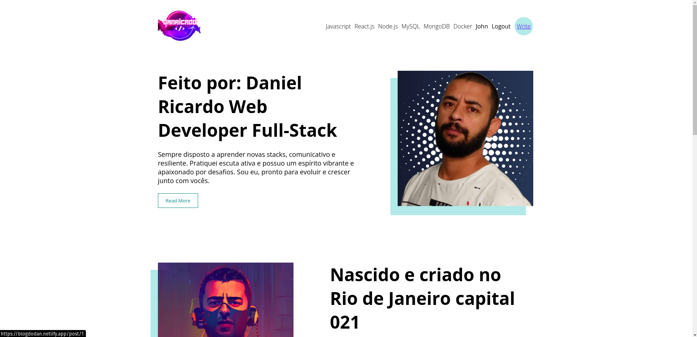

 

<h1 align="center"> Fullstack Blog </h1>

Este é um projeto de blog desenvolvido por hobby com foco em ser uma aplicação fullstack, contendo tanto o frontend quanto o backend. Ainda está em desenvolvimento e faz uso das seguintes tecnologias:

- React: biblioteca JavaScript para criação de interfaces de usuário
- Redux: biblioteca JavaScript para gerenciamento de estado da aplicação
- Node.js: ambiente de execução JavaScript que permite utilizar o JavaScript no backend
- Express: framework para criação de aplicações web em Node.js
- MongoDB: banco de dados NoSQL
- Sass: pré-processador CSS

Além disso, faz uso de diversas outras bibliotecas e ferramentas para auxiliar no desenvolvimento, tais como:

- react-quill: editor de texto rico para React
- emailjs-com: serviço de envio de emails
- moment: biblioteca JavaScript para manipulação de datas e horários
- pigeon-maps: biblioteca React para exibição de mapas
- dompurify: biblioteca JavaScript para sanitização de HTML
- react-icons: biblioteca React para ícones
- axios: biblioteca JavaScript para requisições HTTP
- redux-thunk: middleware Redux para trabalhar com funções assíncronas
- react-redux: biblioteca React para conexão com o Redux
- react-router-dom: biblioteca React para navegação entre rotas
- @redux-devtools/extension: extensão do navegador para desenvolvimento com Redux
- @testing-library/react: biblioteca para testes em React
- @testing-library/jest-dom: biblioteca para testes com Jest e DOM
- @testing-library/user-event: biblioteca para testes com interação do usuário
- web-vitals: biblioteca para medição de métricas de performance

O projeto está disponível em https://blogdodan.netlify.app/ para visualização na web e o código fonte pode ser acessado em https://github.com/danricardo88/FullStack-Blog.

## Como executar o projeto

Para executar o projeto em um ambiente de desenvolvimento local, é necessário ter instalado o Node.js e o MongoDB. Após clonar o repositório, é necessário instalar as dependências do projeto com o comando `npm install` na pasta raiz do projeto. Em seguida, é necessário configurar as variáveis de ambiente em um arquivo `.env` seguindo o modelo do arquivo `.env.example`.

Para executar o frontend, basta executar o comando `npm start` na pasta client. Para executar o backend, basta executar o comando `npm start` na pasta server. É possível também executar ambos ao mesmo tempo com o comando `npm run dev`.

## Como contribuir

Contribuições são sempre bem-vindas! Caso queira contribuir com o projeto, basta criar uma branch a partir da branch `main`, implementar as alterações e abrir um pull request. Certifique-se de seguir as boas práticas de desenvolvimento e incluir testes para as alterações realizadas.

## Licença

Este projeto está licenciado sob a licença MIT.
